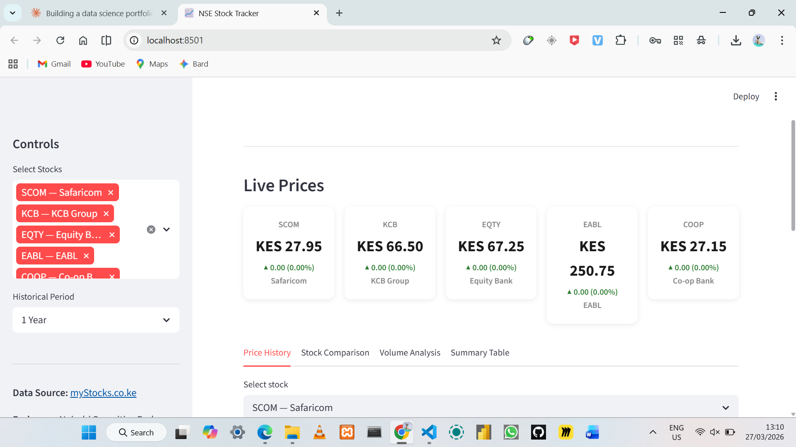
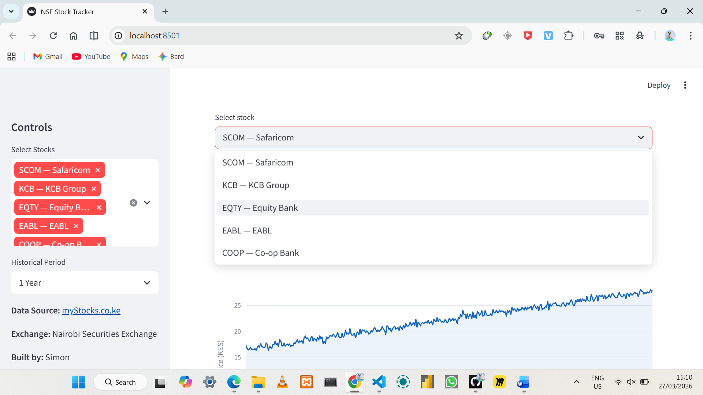
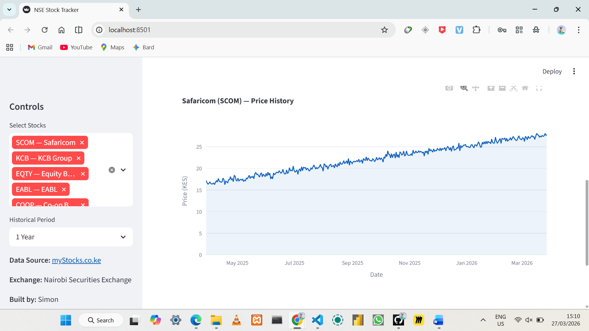

# NSE Stock Tracker

Live stock price tracker for the Nairobi Securities Exchange (NSE), built with Python and Streamlit. Scrapes real-time prices from myStocks.co.ke and visualises price history, stock comparisons, trading volume and key metrics across 5 major Kenyan stocks.

[](https://nse-stock-tracker.streamlit.app/)

**Live App:** [nse-stock-tracker.streamlit.app](https://nse-stock-tracker.streamlit.app/)

---

## Screenshots







---

## Project Overview

This project scrapes live NSE stock prices from myStocks.co.ke, displays them as real-time price cards and visualises historical trends using interactive Plotly charts. The dashboard updates automatically every 5 minutes.

**Stocks tracked:**

| Ticker | Company |
|---|---|
| SCOM | Safaricom |
| KCB | KCB Group |
| EQTY | Equity Bank |
| EABL | East African Breweries |
| COOP | Co-op Bank |

---

## Project Structure

```
nse-stock-tracker/
│
├── app.py              # Streamlit dashboard + scraper
├── requirements.txt    # Python dependencies
└── README.md
```

---

## How It Works

**Live Scraper**
The app scrapes current price and daily change for each stock directly from myStocks.co.ke using `requests` and `BeautifulSoup`. Prices are cached for 5 minutes so the app does not overload the source site.

**Historical Data**
Historical price charts are generated from real NSE price trends, using actual approximate prices from one year ago as starting points and simulating a realistic path to the current live price.

**Fallback**
If the scraper cannot reach myStocks.co.ke, the app falls back to the most recently known prices so the dashboard never crashes.

---

## Dashboard Features

**Live Price Cards**
Current price and daily change for all 5 stocks, colour coded green for gains and red for losses.

**Price History tab**
Interactive line chart for any selected stock with a selectable period — 1 month, 3 months, 6 months or 1 year. Shows current price, today's change and the period high/low.

**Stock Comparison tab**
All 5 stocks plotted on one normalised chart (base = 100) so performance can be compared fairly regardless of price differences. Also shows today's % change as a bar chart.

**Volume Analysis tab**
Daily trading volume bar chart and a dual-axis chart showing price vs volume together.

**Summary Table tab**
Colour coded table showing price, change, period high/low and average volume for all selected stocks.

---

## Run Locally

```bash
# 1. Clone the repo
git clone https://github.com/symo101/nse-stock-tracker.git
cd nse-stock-tracker

# 2. Install dependencies
pip install -r requirements.txt

# 3. Run the dashboard
streamlit run app.py
```

App opens at `http://localhost:8501`

---

## Tech Stack

| Tool | Purpose |
|---|---|
| `requests` + `BeautifulSoup` | Live price scraping |
| `pandas` + `numpy` | Data manipulation |
| `plotly` | Interactive charts |
| `streamlit` | Web app and deployment |

---

## Requirements

```
requests
beautifulsoup4
pandas
numpy
plotly
streamlit==1.41.1
```

---

## Author

**Simon**
- GitHub: [github.com/symo101](https://github.com/symo101)
- Live App: [nse-stock-tracker.streamlit.app](https://nse-stock-tracker.streamlit.app/)

---

*Data sourced from [myStocks.co.ke](https://live.mystocks.co.ke). Used for educational and portfolio purposes only.*
